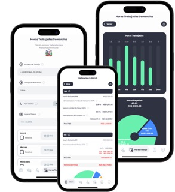
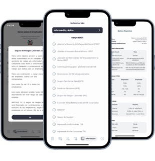

# Cálculo Salarial

https://apps.apple.com/app/id6450862619

**Creado y desarrollado por Luis Ventura (luis.ventura005@gmail.com)**

Cálculo Salarial - Retención, Prestaciones, Costo laboral, Horas trabajadas, Información Código de Trabajo

Encuentra todo lo que necesitas para realizar los cálculos laborales conforme el Código de Trabajo de la República Dominicana:

| Retención Salarial      | Costo Laboral | Prestaciones Laborales    |Horas Trabajadas |
| :----:      |    :----:   |        :----: | :----:
| AFP         | AFP       | Preaviso   | Horas ordinales
| SFS   | SFS        | Cesantía      | Horas extra
| Dependientes   | SRL        | Vacaciones      |Recargo Nocturno
| IRS   | INFOTEP        | Salario Navidad      | Monto salarial
|    | Salario Navidad        |       |
|    | Prima Vacacional        |       |

Calculadora de Prestaciones Laborales

Diseñada para brindar una solución eficiente y precisa a empleadores, trabajadores y usuarios en general que necesiten calcular y determinar el monto de las prestaciones laborales y derechos adquiridos en el ámbito de las relaciones de trabajo. Al ingresar los datos relevantes, como la duración del contrato de trabajo y el salario del empleado, el sistema realiza los cálculos necesarios para determinar el monto correspondiente a las prestaciones laborales que se deben otorgar al finalizar la relación laboral.

Calculadora de salarios

Diseñada para facilitar el cálculo preciso de los ingresos netos de un trabajador. Aplica automáticamente los descuentos legales requeridos, como el descuento de la Tesorería de la Seguridad Social (TSS) y el Impuesto Sobre la Renta (ISR). Estos descuentos son calculados en base a la legislación vigente y las tasas impositivas aplicables.

Calculadora Costo Laboral

Diseñada para ayudar a los empleadores a determinar el gasto total, tanto anual como mensual, que conlleva emplear a un colaborador. Esta herramienta brinda la posibilidad de calcular de manera precisa cuánto le cuesta a la empresa contar con un trabajador, lo cual resulta fundamental para establecer precios competitivos.

Calculadora de Horas Trabajadas

Diseñada especialmente para los asalariados dominicanos, brindándoles la posibilidad de realizar de manera sencilla y precisa el cálculo de sus horas laborales y los montos salariales correspondientes a horas ordinarias, horas extras, recargos nocturnos y montos salariales.

Information rapida

La característica "Información Rápida" es una funcionalidad clave de nuestra aplicación diseñada para proporcionar a los usuarios acceso rápido y fácil a múltiples fuentes de información en un solo lugar. Con esta función, los usuarios pueden obtener datos relevantes y actualizados de manera instantánea, sin la necesidad de navegar por múltiples aplicaciones o realizar búsquedas exhaustivas en la web.

-------------------------------------------------------
